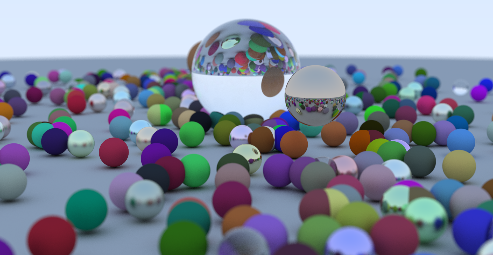

# RustRT
RustRT is a simple ray tracing renderer written in Rust. It is inspired by the "Ray Tracing in One Weekend" series by Peter Shirley. The project supports rendering 3D scenes with various materials, lighting effects, and camera configurations. It demonstrates the fundamentals of ray tracing, including ray-object intersections, shading, and recursive ray bouncing.

## Features

- **Ray Tracing**: Implements a basic ray tracing algorithm to render 3D scenes.
- **Materials**: Supports Lambertian (diffuse), Metal (reflective), and Dielectric (refractive) materials.
- **Camera**: Configurable camera with depth of field and defocus blur.
- **Bounding Volume Hierarchy (BVH)**: Accelerates ray-object intersection tests for complex scenes.
- **Multithreading**: Utilizes multiple threads for faster rendering.
- **Output Formats**: Renders to a `.ppm` file or displays the result in a window.

## Example Output

Below is an example of an image rendered using RustRT:

